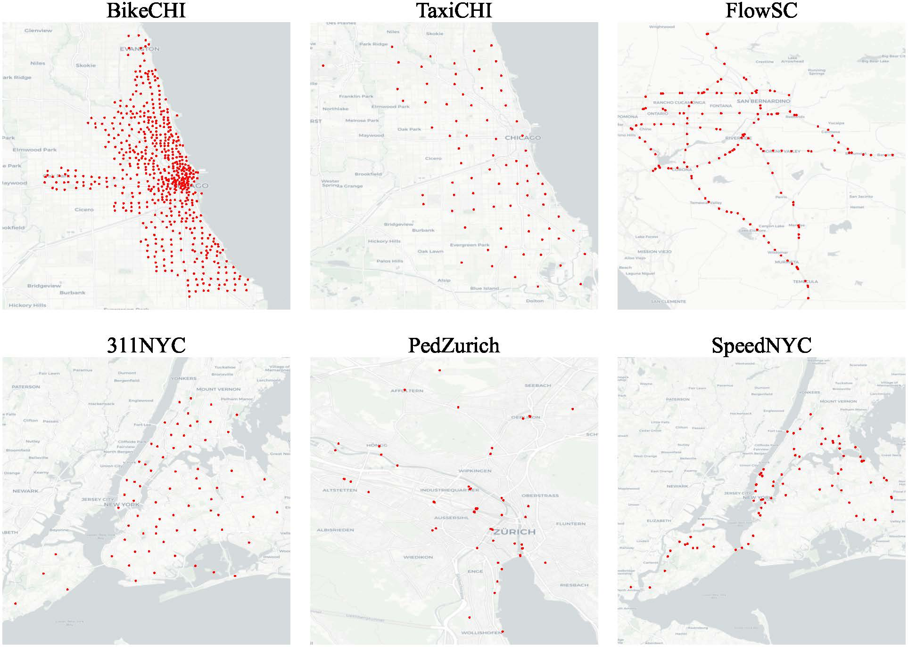

# ST-OOD: A Benchmark for Evaluating Spatiotemporal Out-of-Distribution Generalization

ST-OOD is a comprehensive benchmark designed to evaluate the generalization capabilities of spatiotemporal models in out-of-distribution (OOD) scenarios. This repository contains the datasets, code, and experimental results for the ST-OOD benchmark.

## Overview

Urban environments are constantly evolving, and current spatiotemporal model evaluations are often limited to short-term scenarios. ST-OOD addresses this gap by providing a diverse set of urban datasets spanning multiple years, allowing for robust evaluation of model performance in both in-distribution and out-of-distribution settings.

## Datasets

ST-OOD comprises six urban scenario datasets:



1. Bike-sharing (Chicago)
2. 311 services (New York City)
3. Pedestrian counts (Zurich) 
4. Traffic speed (New York City)
5. Traffic flow (California)
6. Ride-hailing demand (Chicago)

Each dataset includes:
- Training data from one year
- In-distribution test data from the same year
- Out-of-distribution test data from the following year

## Key Features

- First open-source spatiotemporal benchmark for OOD evaluation
- Comprehensive evaluation of state-of-the-art spatiotemporal models
- Analysis of model performance degradation in OOD settings
- Investigation of dropout techniques to improve generalization

## Installation

```bash
git clone https://github.com/your-username/ST-OOD.git
cd ST-OOD
```

## Usage

Details on how to run experiments, train models, and evaluate results will be added here.

## Results

Our experiments reveal that:

- Most models perform significantly worse in OOD settings compared to in-distribution scenarios
- Simple models like STID and MLP often outperform more complex models in OOD tasks
- Applying dropout can significantly improve generalization performance with minimal impact on in-distribution results

For detailed results and analysis, please refer to the full paper.

## Citation

If you use ST-OOD in your research, please cite our paper:

```bibtex
@article{wang2024stood,
  title={Evaluating the Generalization Ability of Spatiotemporal Model in Urban Scenario},
  author={Wang, Hongjun and Chen, Jiyuan and Pan, Tong and Dong, Zheng and Zhang, Lingyu and Jiang, Renhe and Song, Xuan},
  journal={arXiv preprint arXiv:XXXX.XXXXX},
  year={2024}
}
```

## License

This project is licensed under the [MIT License](LICENSE).

## Contact

For any questions or concerns, please open an issue or contact the authors.